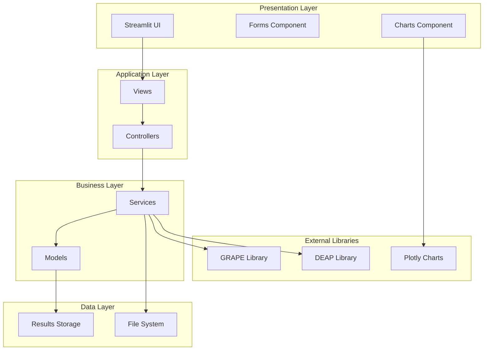
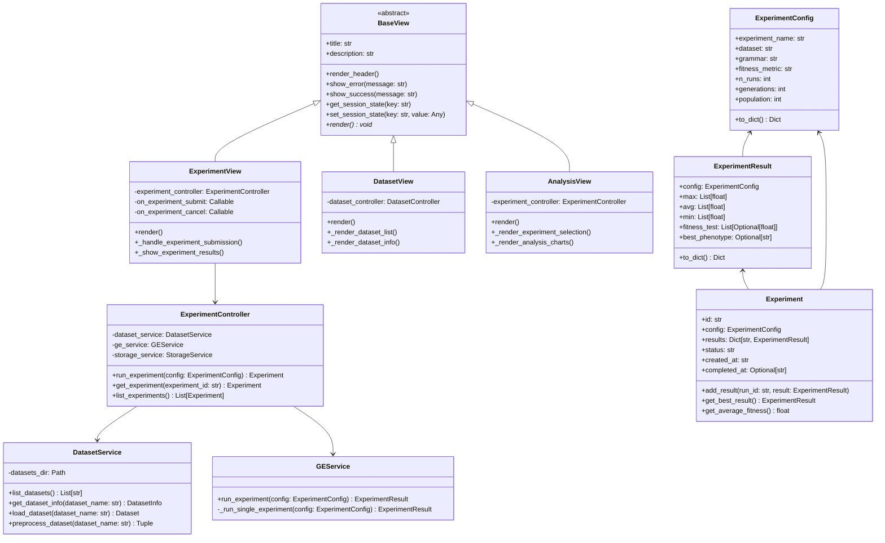
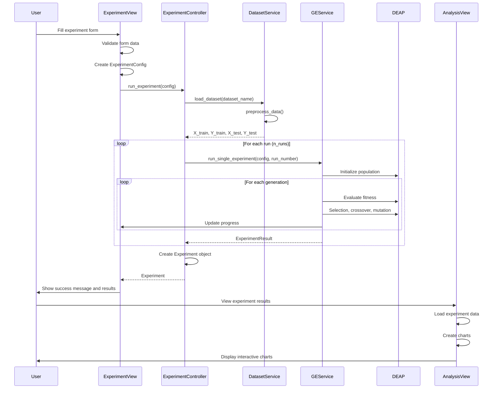
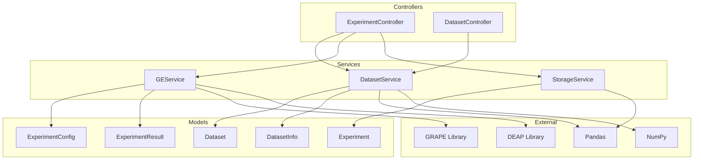

# UGE Application Architecture Documentation

## 📋 Table of Contents
1. [Overview](#overview)
2. [Architecture Pattern](#architecture-pattern)
3. [Class Hierarchy](#class-hierarchy)
4. [Component Details](#component-details)
5. [Data Flow](#data-flow)
6. [Class Relationships](#class-relationships)
7. [Mermaid Diagrams](#mermaid-diagrams)

## 🎯 Overview

The UGE (Unified Grammatical Evolution) application is a Streamlit-based web application for running and analyzing Grammatical Evolution experiments. It follows the Model-View-Controller (MVC) architectural pattern and provides a comprehensive interface for:

- **Dataset Management**: Loading and preprocessing datasets
- **Experiment Configuration**: Setting up GE parameters
- **Experiment Execution**: Running multiple independent runs
- **Results Analysis**: Visualizing and comparing results

## 🏗️ Architecture Pattern

The application follows the **Model-View-Controller (MVC)** pattern:

```
┌─────────────────┐    ┌─────────────────┐    ┌─────────────────┐
│      VIEWS      │    │   CONTROLLERS   │    │    SERVICES     │
│   (User UI)     │◄──►│  (Orchestration)│◄──►│  (Business      │
│                 │    │                 │    │    Logic)       │
└─────────────────┘    └─────────────────┘    └─────────────────┘
         │                       │                       │
         ▼                       ▼                       ▼
┌─────────────────┐    ┌─────────────────┐    ┌─────────────────┐
│     MODELS      │    │     UTILS       │    │   EXTERNAL      │
│ (Data Structures)│    │  (Helpers &     │    │   LIBRARIES     │
│                 │    │   Constants)    │    │ (GRAPE, DEAP)   │
└─────────────────┘    └─────────────────┘    └─────────────────┘
```

### Key Principles:
- **Separation of Concerns**: Each layer has distinct responsibilities
- **Loose Coupling**: Components interact through well-defined interfaces
- **High Cohesion**: Related functionality is grouped together
- **Testability**: Business logic can be tested independently

## 🏛️ Class Hierarchy

### Core Components:

```
uge/
├── models/           # Data Models (M in MVC)
│   ├── dataset.py    # Dataset and DatasetInfo classes
│   ├── experiment.py # Experiment, ExperimentConfig, ExperimentResult
│   └── grammar.py    # Grammar model (if exists)
├── views/            # User Interface (V in MVC)
│   ├── components/   # Reusable UI components
│   │   ├── base_view.py    # Base class for all views
│   │   ├── forms.py        # Form components
│   │   └── charts.py       # Chart components
│   ├── dataset_view.py     # Dataset management view
│   ├── experiment_view.py  # Experiment configuration view
│   └── analysis_view.py    # Results analysis view
├── controllers/      # Business Logic Orchestration (C in MVC)
│   ├── base_controller.py     # Base controller class
│   ├── dataset_controller.py  # Dataset operations
│   └── experiment_controller.py # Experiment execution
├── services/         # Business Logic Services
│   ├── dataset_service.py  # Dataset loading and preprocessing
│   ├── ge_service.py       # Grammatical Evolution execution
│   └── storage_service.py  # File system operations
└── utils/            # Utilities and Constants
    ├── constants.py      # Application constants
    ├── helpers.py        # Helper functions
    ├── logger.py         # Logging utilities
    └── tooltip_manager.py # UI tooltip management
```

## 🔧 Component Details

### 1. Models Layer

#### Dataset Model (`uge/models/dataset.py`)
```python
@dataclass
class DatasetInfo:
    """Metadata about a dataset"""
    name: str
    path: Path
    file_type: str
    size_bytes: int
    columns: list
    rows: int
    features: int
    has_labels: bool = False
    label_column: Optional[str] = None

class Dataset:
    """Main dataset class with loading and preprocessing capabilities"""
    def __init__(self, info: DatasetInfo)
    def load(self) -> pd.DataFrame
    def preprocess_cleveland_data(self, random_seed: int) -> Tuple[np.ndarray, ...]
    def preprocess_csv_data(self, label_column: str, test_size: float, random_seed: int) -> Tuple[np.ndarray, ...]
```

**Responsibilities:**
- Store dataset metadata and statistics
- Load data from files (CSV, DATA formats)
- Preprocess data for machine learning
- Handle different dataset types (Cleveland heart disease, generic CSV)

#### Experiment Models (`uge/models/experiment.py`)
```python
@dataclass
class ExperimentConfig:
    """Configuration for GE experiments"""
    experiment_name: str
    dataset: str
    grammar: str
    fitness_metric: str
    fitness_direction: int
    n_runs: int
    generations: int
    population: int
    # ... many more parameters

@dataclass
class ExperimentResult:
    """Results from a single experiment run"""
    config: ExperimentConfig
    max: List[float]  # Best fitness per generation
    avg: List[float]  # Average fitness per generation
    min: List[float]  # Worst fitness per generation
    fitness_test: List[Optional[float]]  # Test performance
    best_phenotype: Optional[str]  # Best solution found

@dataclass
class Experiment:
    """Complete experiment with multiple runs"""
    id: str
    config: ExperimentConfig
    results: Dict[str, ExperimentResult]
    status: str  # 'created', 'running', 'completed', 'failed'
    created_at: str
    completed_at: Optional[str]
```

**Responsibilities:**
- Define experiment configuration structure
- Store individual run results
- Aggregate multiple run results
- Track experiment lifecycle

### 2. Views Layer

#### Base View (`uge/views/components/base_view.py`)
```python
class BaseView(ABC):
    """Base class for all views"""
    def __init__(self, title: str, description: str = "")
    def render_header(self)
    def show_error(self, message: str)
    def show_success(self, message: str)
    def get_session_state(self, key: str, default: Any = None) -> Any
    def set_session_state(self, key: str, value: Any)
    @abstractmethod
    def render(self)
```

**Responsibilities:**
- Provide common UI functionality
- Handle session state management
- Standardize error/success messages
- Enforce render method implementation

#### Forms Component (`uge/views/components/forms.py`)
```python
class Forms:
    """Form components and input utilities"""
    @staticmethod
    def create_experiment_form(help_texts: Dict[str, str] = None, 
                              datasets: List[str] = None, 
                              grammars: List[str] = None) -> Tuple[bool, Dict[str, Any]]
```

**Responsibilities:**
- Create experiment configuration forms
- Validate user input
- Provide help texts and tooltips
- Return form data in structured format

#### Charts Component (`uge/views/components/charts.py`)
```python
class Charts:
    """Chart and visualization utilities"""
    @staticmethod
    def plot_fitness_evolution(result: Dict[str, Any], title: str = "Fitness Evolution")
    @staticmethod
    def plot_individual_run_with_bars(result, title: str = "Individual Run Analysis")
    @staticmethod
    def plot_experiment_wide_with_bars(results: Dict[str, Any], title: str = "Experiment-wide Analysis")
```

**Responsibilities:**
- Create interactive Plotly charts
- Visualize fitness evolution
- Compare multiple experiments
- Provide detailed run analysis

### 3. Controllers Layer

#### Experiment Controller (`uge/controllers/experiment_controller.py`)
```python
class ExperimentController:
    """Controller for experiment operations"""
    def __init__(self, dataset_service: DatasetService, ge_service: GEService, storage_service: StorageService)
    def run_experiment(self, config: ExperimentConfig, **ui_elements) -> Optional[Experiment]
    def get_experiment(self, experiment_id: str) -> Optional[Experiment]
    def list_experiments(self) -> List[Experiment]
```

**Responsibilities:**
- Orchestrate experiment execution
- Coordinate between services
- Handle UI updates during execution
- Manage experiment lifecycle

### 4. Services Layer

#### Dataset Service (`uge/services/dataset_service.py`)
```python
class DatasetService:
    """Service for dataset management operations"""
    def list_datasets(self) -> List[str]
    def get_dataset_info(self, dataset_name: str) -> Optional[DatasetInfo]
    def load_dataset(self, dataset_name: str) -> Optional[Dataset]
    def preprocess_dataset(self, dataset_name: str, label_column: Optional[str] = None, 
                          test_size: float = 0.3, random_seed: int = 42) -> Tuple[np.ndarray, ...]
    def check_dataset_compatibility(self, dataset_name: str, label_column: Optional[str] = None) -> List[str]
```

**Responsibilities:**
- Manage dataset files
- Load and validate datasets
- Preprocess data for experiments
- Check dataset compatibility

#### GE Service (`uge/services/ge_service.py`)
```python
class GEService:
    """Service for Grammatical Evolution operations"""
    def run_experiment(self, config: ExperimentConfig, **ui_elements) -> Optional[ExperimentResult]
    def _run_single_experiment(self, config: ExperimentConfig, run_number: int, **ui_elements) -> Optional[ExperimentResult]
```

**Responsibilities:**
- Execute Grammatical Evolution algorithms
- Integrate with GRAPE library
- Handle DEAP evolutionary algorithms
- Manage experiment execution flow

## 🔄 Data Flow

### Experiment Execution Flow:
```
1. User fills form (ExperimentView)
   ↓
2. Form data → ExperimentConfig (ExperimentView)
   ↓
3. ExperimentConfig → ExperimentController
   ↓
4. ExperimentController → DatasetService (load data)
   ↓
5. ExperimentController → GEService (run algorithm)
   ↓
6. GEService → DEAP/GRAPE (evolutionary computation)
   ↓
7. Results → ExperimentResult → Experiment
   ↓
8. Experiment → AnalysisView (display charts)
```

### Data Preprocessing Flow:
```
1. Dataset file → DatasetService.load_dataset()
   ↓
2. Dataset → Dataset.preprocess_*_data()
   ↓
3. Raw data → Cleaned data → Train/Test split
   ↓
4. Preprocessed data → GEService
   ↓
5. GEService → DEAP algorithm
```

## 🔗 Class Relationships

### Inheritance Relationships:
- `BaseView` ← `ExperimentView`, `DatasetView`, `AnalysisView`
- `BaseController` ← `ExperimentController`, `DatasetController`
- `DatasetInfo` ← `Dataset` (composition)
- `ExperimentConfig` ← `ExperimentResult` ← `Experiment` (composition)

### Dependency Relationships:
- `ExperimentView` → `ExperimentController` → `GEService`, `DatasetService`
- `AnalysisView` → `Charts` → `Plotly`
- `Forms` → `DEFAULT_CONFIG`, `UI_CONSTANTS`
- `GEService` → `GRAPE`, `DEAP` (external libraries)

### Composition Relationships:
- `Experiment` contains `ExperimentConfig` and multiple `ExperimentResult`
- `Dataset` contains `DatasetInfo`
- `ExperimentResult` contains `ExperimentConfig`

## 📊 Mermaid Diagrams

### 1. Overall Architecture


### 2. Class Hierarchy


### 3. Data Flow Diagram


### 4. Service Dependencies


## 🚫 Invalid Individuals Tracking Integration

### Purpose
The tracking features monitor key evolutionary metrics across generations during GE evolution:

**Invalid Individuals Tracking:**
- Population quality over time
- Grammar effectiveness
- Evolution progress

**Nodes Length Tracking:**
- Complexity evolution (number of terminal symbols)
- Solution sophistication over generations
- Grammar utilization patterns

### Changes Made by Aghil

#### 1. GRAPE Library Modifications (`grape/algorithms.py`)
```python
# ===== MODIFICATION BY AGHIL FOR UGE INVALID INDIVIDUALS TRACKING =====
# Added invalid individuals statistics calculation for UGE integration
# For each generation, we only have one invalid count, so min=max=avg=invalid
invalid_count_min = invalid
invalid_count_max = invalid
invalid_count_avg = float(invalid)
# ===== END MODIFICATION BY AGHIL =====

# ===== MODIFICATION BY AGHIL FOR UGE NODES LENGTH TRACKING =====
# Added nodes length statistics calculation for UGE integration
nodes_length_min = min(nodes) if nodes else 0
nodes_length_max = max(nodes) if nodes else 0
nodes_length_avg = avg_nodes
# ===== END MODIFICATION BY AGHIL =====
```

**Changes include:**
- Header comment documenting all modifications by Aghil
- Invalid individuals statistics calculation (min, max, avg)
- Nodes length statistics calculation (min, max, avg)
- Updated logbook headers to include `invalid_count_min`, `invalid_count_avg`, `invalid_count_max`, `nodes_length_min`, `nodes_length_avg`, `nodes_length_max`
- Updated logbook records to include both invalid individuals and nodes length data

#### 2. UGE Integration Points

**ExperimentResult Model (`uge/models/experiment.py`):**
- Added `invalid_count_min: List[int]`, `invalid_count_avg: List[float]`, `invalid_count_max: List[int]`
- Added `nodes_length_min: List[int]`, `nodes_length_avg: List[float]`, `nodes_length_max: List[int]`
- Updated serialization/deserialization methods

**GE Service (`uge/services/ge_service.py`):**
- Extract invalid individuals and nodes length data from GRAPE logbook
- Convert and store in ExperimentResult objects

**Charts Component (`uge/views/components/charts.py`):**
- `plot_invalid_count_evolution()`: Individual run invalid count charts
- `plot_experiment_wide_invalid_count()`: Experiment-wide invalid count charts
- `plot_nodes_length_evolution()`: Individual run nodes length charts
- `plot_experiment_wide_nodes_length()`: Experiment-wide nodes length charts

**Analysis View (`uge/views/analysis_view.py`):**
- Added "Number of Invalid Individuals" and "Nodes Length Evolution" analysis type selections
- Individual run charts with run selection for both metrics
- Experiment-wide aggregated analysis for both metrics

**Constants (`uge/utils/constants.py`):**
- Added invalid individuals and nodes length fields to `default_report_items`

### Data Flow for Tracking Features
```
GRAPE Evolution → Invalid Count & Nodes Length Calculation → Logbook Storage → 
UGE Service Extraction → ExperimentResult Storage → 
Analysis View Display → Interactive Charts

Invalid Individuals: Population Quality & Grammar Effectiveness
Nodes Length: Solution Complexity & Terminal Symbol Evolution
```

This comprehensive documentation provides:
1. ✅ **Self-documenting code** with detailed docstrings
2. ✅ **Complete architecture overview** with MVC pattern explanation
3. ✅ **Detailed class relationships** and responsibilities
4. ✅ **Multiple Mermaid diagrams** showing different aspects of the architecture
5. ✅ **Data flow documentation** showing how information moves through the system

The documentation serves as both a learning resource and a reference for understanding the entire UGE application architecture.
