# 🏗️ UGE Application Architecture Diagrams

This document contains comprehensive Mermaid diagrams showing the object-oriented architecture of the UGE application.

## 📊 1. Overall System Architecture


## 🏛️ 2. Class Hierarchy and Inheritance


## 🔄 3. Data Flow Sequence Diagram


## 🏗️ 4. Component Dependencies

```mermaid
graph TD
    subgraph "🎨 UI Layer"
        UI[Streamlit App]
        Forms[Forms Component]
        Charts[Charts Component]
    end
    
    subgraph "📱 View Layer"
        EV[SetupView]
        DV[DatasetView]
        AV[AnalysisView]
        BV[BaseView]
    end
    
    subgraph "🎮 Controller Layer"
        EC[SetupController]
        DC[DatasetController]
        BC[BaseController]
    end
    
    subgraph "⚙️ Service Layer"
        GES[GEService]
        DS[DatasetService]
        SS[StorageService]
    end
    
    subgraph "📊 Model Layer"
        E[Setup]
        ECONF[SetupConfig]
        ER[SetupResult]
        D[Dataset]
        DI[DatasetInfo]
    end
    
    subgraph "🔧 External Dependencies"
        GRAPE[GRAPE Library]
        DEAP[DEAP Library]
        PLOTLY[Plotly]
        PANDAS[Pandas]
        NUMPY[NumPy]
        SKLEARN[Scikit-learn]
    end
    
    %% UI to Views
    UI --> EV
    UI --> DV
    UI --> AV
    
    %% Views inheritance
    BV <|-- EV
    BV <|-- DV
    BV <|-- AV
    
    %% Views to Controllers
    EV --> EC
    DV --> DC
    
    %% Controllers inheritance
    BC <|-- EC
    BC <|-- DC
    
    %% Controllers to Services
    EC --> GES
    EC --> DS
    EC --> SS
    DC --> DS
    
    %% Services to Models
    GES --> ECONF
    GES --> ER
    DS --> D
    DS --> DI
    SS --> E
    
    %% Model relationships
    E *-- ECONF
    E *-- ER
    ER *-- ECONF
    D *-- DI
    
    %% External dependencies
    GES --> GRAPE
    GES --> DEAP
    Charts --> PLOTLY
    DS --> PANDAS
    DS --> NUMPY
    DS --> SKLEARN
    Forms --> PLOTLY
```

## 📊 5. Setup Lifecycle


## 🔧 6. Service Architecture

```mermaid
graph LR
    subgraph "🎮 Controllers"
        EC[Setup<br/>Controller]
        DC[Dataset<br/>Controller]
    end
    
    subgraph "⚙️ Core Services"
        GES[GE Service<br/>Algorithm Execution]
        DS[Dataset Service<br/>Data Management]
        SS[Storage Service<br/>Persistence]
    end
    
    subgraph "🔧 Utility Services"
        LS[Logger Service<br/>Logging]
        CS[Config Service<br/>Configuration]
        VS[Validation Service<br/>Input Validation]
    end
    
    subgraph "📊 External Integrations"
        GRAPE[GRAPE<br/>GE Library]
        DEAP[DEAP<br/>Evolutionary Algorithms]
        FS[File System<br/>Storage]
    end
    
    EC --> GES
    EC --> DS
    EC --> SS
    DC --> DS
    
    GES --> GRAPE
    GES --> DEAP
    DS --> FS
    SS --> FS
    
    GES --> LS
    DS --> VS
    SS --> CS
```



## 🎯 7. User Interaction Flow


## 📈 8. Performance Monitoring

```mermaid
graph TB
    subgraph "📊 Metrics Collection"
        EM[Setup Metrics]
        PM[Performance Metrics]
        SM[System Metrics]
    end
    
    subgraph "🔍 Analysis Layer"
        DA[Data Analysis]
        PA[Performance Analysis]
        RA[Resource Analysis]
    end
    
    subgraph "📈 Visualization"
        CD[Charts & Dashboards]
        AL[Alerts & Notifications]
        RP[Reports]
    end
    
    EM --> DA
    PM --> PA
    SM --> RA
    
    DA --> CD
    PA --> AL
    RA --> RP
```



---

These diagrams provide a comprehensive view of the UGE application's object-oriented architecture, showing:

1. **System Architecture**: Overall system structure and layers
2. **Class Hierarchy**: Inheritance and composition relationships
3. **Data Flow**: How data moves through the system
4. **Component Dependencies**: What depends on what
5. **Setup Lifecycle**: States and transitions
6. **Service Architecture**: Service organization and responsibilities
7. **User Journey**: User interaction flow
8. **Performance Monitoring**: Metrics and analysis structure

Each diagram can be rendered using any Mermaid-compatible tool or viewer to provide visual understanding of the system architecture.
